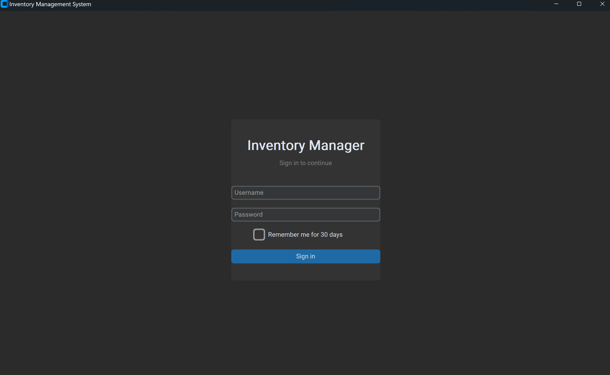
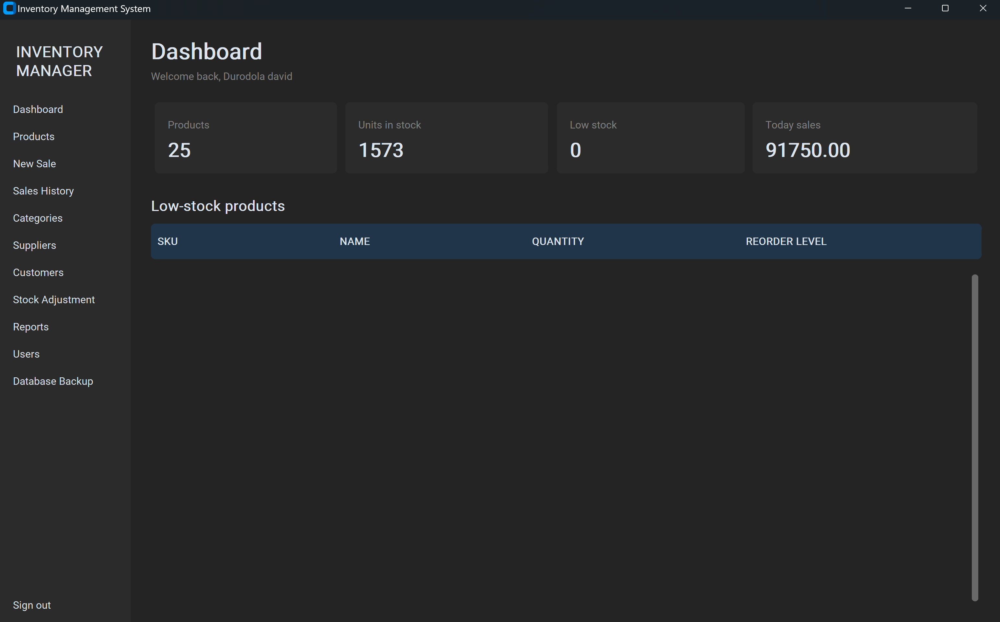
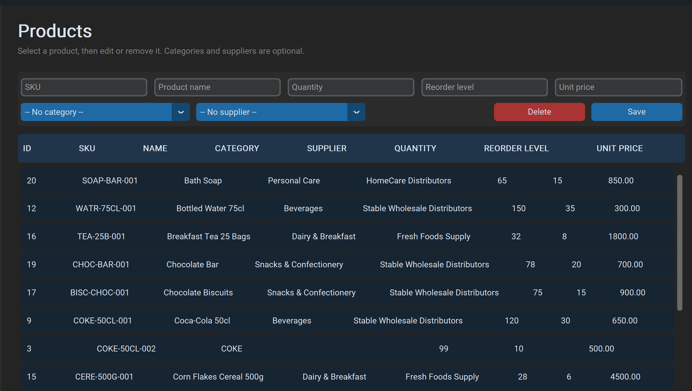
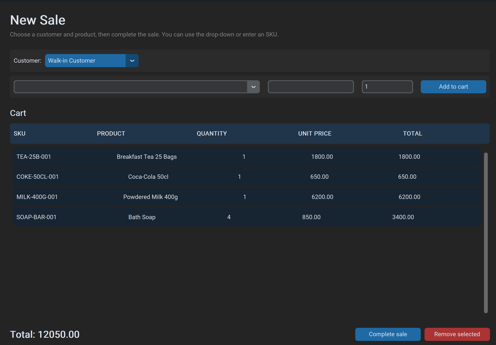
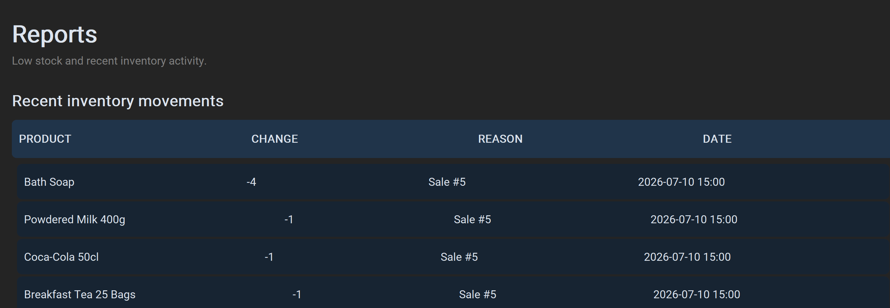

# 🛒 Stable Supermarket Inventory Management System

[](https://img.shields.io/badge/Python-3.14-blue?logo=python)
[](https://img.shields.io/badge/GUI-CustomTkinter-blue)
[](https://img.shields.io/badge/Database-MySQL-orange?logo=mysql)
[](https://img.shields.io/badge/Server-XAMPP-FB7A24?logo=xampp)
[](https://img.shields.io/badge/License-MIT-green)

A modern desktop-based **Inventory and Sales Management System** built with **Python**, **CustomTkinter**, and **MySQL/MariaDB**.

The application helps supermarkets manage inventory, monitor stock levels, process sales, generate receipts, track customers and suppliers, and generate business reports — all through a modern desktop interface.

> **In short:** a single-store point-of-sale and stock-control tool that replaces spreadsheets with a proper login-gated desktop app, real-time stock deduction on sale, and printable reports.

---


## ✨ Features

- Secure Administrator Login
- Staff User Management
- Product Management
- Category Management
- Supplier Management
- Customer Management
- Inventory Tracking
- Product Search (SKU & Name)
- Sales Processing
- Shopping Cart System
- Automatic Stock Deduction
- Receipt Generation
- Sales History
- Inventory Reports
- Low Stock Monitoring
- Stock Adjustment (Restock / Damaged Items)
- Database Backup
- Modern CustomTkinter User Interface

---

## 🛠 Technologies Used

- Python 3
- CustomTkinter
- MySQL / MariaDB
- XAMPP
- python-dotenv
- Pillow
- ReportLab

---

## 🚀 Quick Start

### 1. Clone the repository
```bash
git clone https://github.com/Durodola2/Stable-Supermarket-Inventory-System.git
```

### 2. Open the project
```bash
cd Stable-Supermarket-Inventory-System
```

### 3. Start MySQL
Start **Apache** and **MySQL** using XAMPP.

### 4. Import the database
Import `database/schema.sql` using **phpMyAdmin**.

### 5. Configure environment variables
Copy `.env.example` to `.env` and update your database credentials.

### 6. Install dependencies
```bash
.\.venv\Scripts\python.exe -m pip install -r requirements.txt
```

### 7. Run the application
```bash
.\.venv\Scripts\python.exe main.py
```

The first launch allows you to create the administrator account.

---

## 🖥 Windows Executable

A packaged build is attached to the [Releases](https://github.com/Durodola2/Stable-Supermarket-Inventory-System/releases) page — download `StableSupermarket.exe` from the latest release instead of building from source if you just want to try the app.

To run it:
- Keep `.env` beside the executable.
- Start MySQL using XAMPP.
- Double-click `StableSupermarket.exe`.

---

## 📸 Screenshots

| Login | Dashboard |
|---|---|
|  |  |

| Product Management | Sales |
|---|---|
|  |  |

| Reports |
|---|
|  |

---

## 📂 Project Structure

```
Stable-Supermarket-Inventory-System
│
├── database/
│   └── schema.sql
│
├── docs/
│   └── PROJECT_DOCUMENTATION.md
│
├── screenshots/
│
├── main.py
├── requirements.txt
├── README.md
├── .gitignore
└── .env.example
```

> Note: `build/`, `dist/`, and `receipts/` are generated at build/runtime and are intentionally excluded from version control (see `.gitignore`). Grab the packaged executable from [Releases](https://github.com/Durodola2/Stable-Supermarket-Inventory-System/releases) instead of the `dist/` folder.

---

## 📚 Documentation

Complete project documentation is available inside `docs/PROJECT_DOCUMENTATION.md`, including:

- System Overview
- Database Design
- Features
- User Roles
- System Workflow
- Backup Guide
- Installation Guide
- Development Notes

---

## 🧭 Known Limitations & Future Improvements

This is a single-store, single-database desktop app — a few deliberate scope trade-offs worth noting:

- No automated tests yet — the DB layer would benefit from unit tests around stock deduction logic
- Single-branch only; no multi-location stock sync
- No role-based permission granularity beyond admin/staff
- Barcode input is manual (SKU/name search) rather than hardware-scanner integrated

**Planned next:**
- Barcode Scanner Integration
- QR Code Product Lookup
- Sales Analytics Dashboard
- Employee Activity Logs
- Multi-Branch Support
- Cloud Synchronization
- Email Receipts
- SMS Notifications

---

## 🔒 Security

The project uses:

- Environment Variables (`.env`)
- Password Authentication
- Database Validation
- Input Validation
- Automatic Inventory Updates

> **Important:** Never upload your `.env` file. It contains local database credentials and is ignored by `.gitignore`.

---

## 👨‍💻 Author

**David Durodola**
Backend & Data Engineer

GitHub: [https://github.com/Durodola2](https://github.com/Durodola2)
Email: durodoladavid3@gmail.com

---

## 📄 License

This project is licensed under the [MIT License](./LICENSE).
